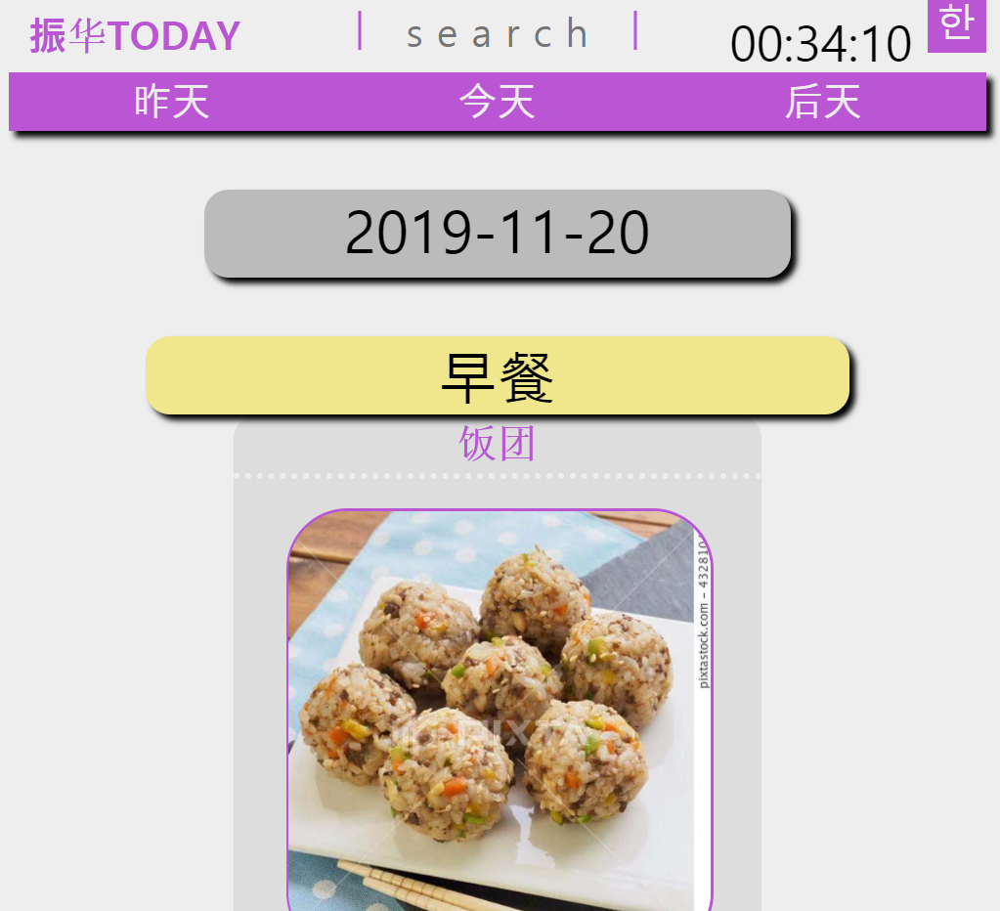
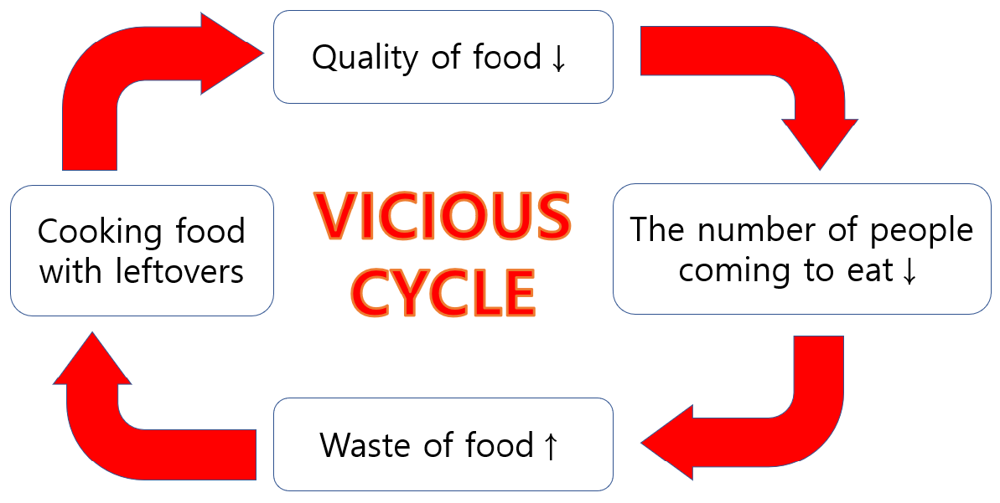

# 振华TODAY
[→LINK←](http://zhenhuatoday.com)
***

## 1) What is 振华TODAY
### 1.1 A brief introduction
[振华TODAY](http://zhenhuatoday.com) is a **website** that shows the **school meals** of [沧州振华国际学校](http://www.pk-edu.com/) in advance.
>The picture below(↓) is the screenshot on Nov 20, 2019

### 1.2 History
- [振华TODAY](http://zhenhuatoday.com) was first planned in **June 2019**.
- [振华TODAY](http://zhenhuatoday.com) was officially deployed on **Oct 9, 2019**, and the number of visitors of this date was **99**.
- [振华TODAY](http://zhenhuatoday.com) had a large design update on **Nov 20, 2019**
### 1.3 Who made it
**Kim Hoojun** was in charge of ***planning***, ***designing***, and ***developing*** the project.

***

## 2) Why I made 振华TODAY
### 2.1 Convenience of students
`"I decided to develop a website when I saw that students were inconvenient not knowing the school meals"`
### 2.2 Improvement of the quality

`->Because the quality of food is low, nobody comes to eat.`
`->Because nobody comes to eat, waste of food increases.`
`->Because waste of food increases, food is cooked with leftovers.`
`->Because food is cooked with leftovers, food loses its quality`
**`"After analyzing the cause of low quality of the school meals, I found out that the four things above(↑) form a vicious cycle. And I thought one way to break the cycle was to let students know the school meals in advance."`**

***

## 3) How I made 振华TODAY
### 3.1 Programming languages
- **HTML**
- **CSS**
- **Javascript**
- **PHP**
> I didn't use any libraries or frameworks (even JQUERY)
### 3.2 Development tools
- [Visual Studio Code](https://code.visualstudio.com/) for **code editor**
- [FileZilla](https://filezilla-project.org/) for **FTP**
- [Google Chrome](https://www.google.com/intl/ko/chrome/) for **web browser**
- [Git](https://git-scm.com/) and [Github](https://github.com/) for **version management**
### 3.3 Others
- [Whois](http://whois.co.kr/) for **domain**
- [Cafe24](https://www.googleadservices.com/pagead/aclk?sa=L&ai=DChcSEwjC5a6tzPDlAhVBPmAKHUZsCV8YABAAGgJ0bQ&ohost=www.google.com&cid=CAASE-RozymF0NeQotZvWTJDiA5uV8A&sig=AOD64_2wpBYJkE6CNOYCeCZdDhISj6U-yQ&q=&ved=2ahUKEwjt46etzPDlAhXyyosBHROIB-8Q0Qx6BAgPEAE&adurl=) for **hosting**
- [My mom]() and [dad]() for **supporting me**

***

## 4) Update notes
- [2019-11-20] Made a large-scale design update; Most PHP codes were rewritten in Javascript.
- [2019-12-18] Made a d-day from university examinations.
- [2019-12-29] Made a auto-complete function for menu-input